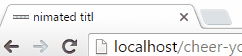

# Cheer your title
Sometimes your &lt;title&gt; tag needs some joy

## Contributing
Here's some guide on how to run and contribute to this project.

As it is quite old, there's a `Dockerfile` to run build an old node version. This is required because the gulp 3.9 doesn't play nice with newer versions of node since graceful-fs doesn't monkey patch some functions anymore. Please refer to [this](https://stackoverflow.com/questions/55921442/how-to-fix-referenceerror-primordials-is-not-defined-in-node-js).

All the commands will be run inside this container as it run an older nodejs version.

### Building the Dockerfile
It relies on `make`, so just run `make container`

### Installing the dependencies
You must install the dependencies locally since I didn't have much time to run everything on the docker. Just run `npm i --includes=dev` and it should be good to to.

### Building the project
You can run using `make build`. It will build the docker container and run the gulp command. The output will be on the `build` folder

### Testing
For some mysterious reasons, the test doesn't work from inside the docker. Just run `npm test` on your local machine and it will probably work. Let's hope for the best